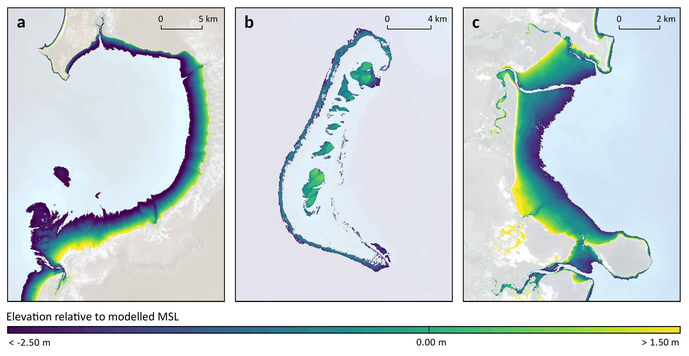
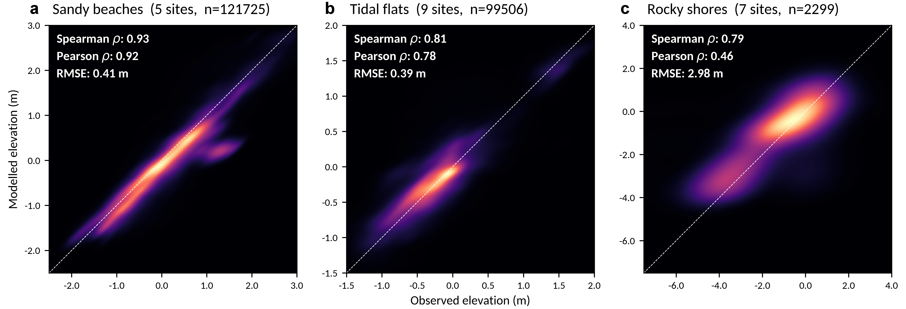
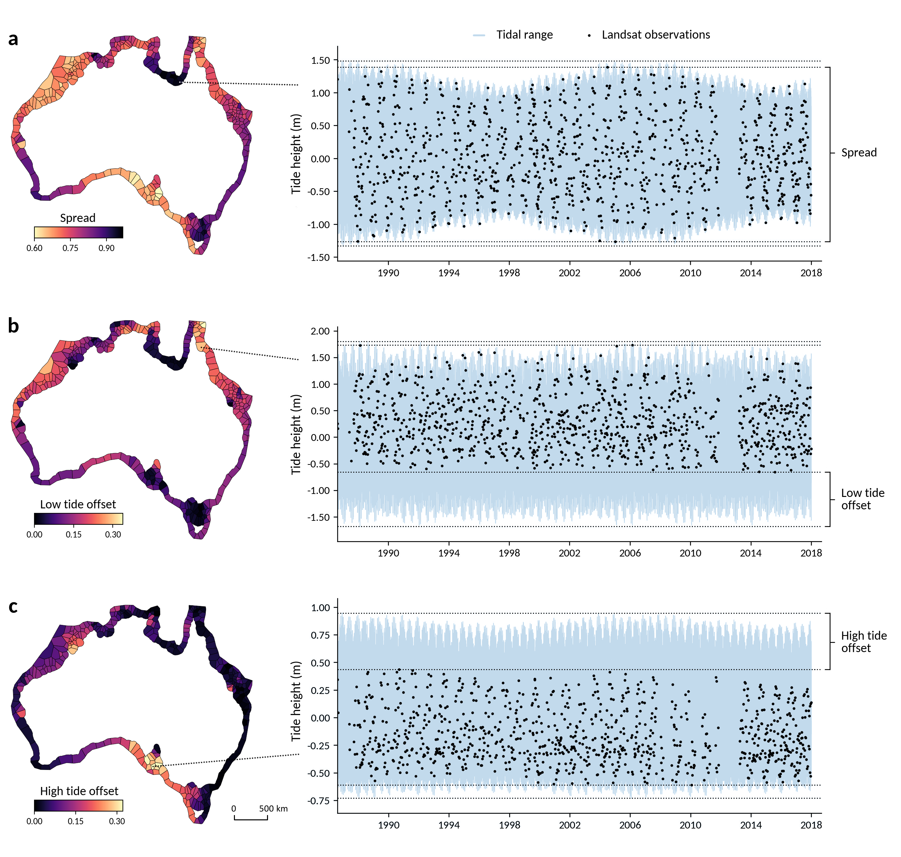

# National Intertidal Digital Elevation Model (NIDEM)

**Date:** January 2019

**Author:** Robbi Bishop-Taylor, Steven Sagar, Leo Lymburner

## Data availability

Data available via THREDDS: http://pid.geoscience.gov.au/dataset/ga/123678

To view and access the data interactively, visit http://nationalmap.gov.au. Select 'Add data', and then the 'Surface Water and Marine/Tidal' theme. Click on 'National Intertidal Digital Elevation Model 25m 1.0.0' and then 'Add to the map'.

## Abstract

The National Intertidal Digital Elevation Model (NIDEM) product is a continental-scale dataset providing continuous elevation data for Australia's exposed intertidal zone. NIDEM provides the first three-dimensional representation of Australia's intertidal zone (excluding off-shore Territories and intertidal mangroves) at 25 m spatial resolution, addressing a key gap between the availability of sub-tidal bathymetry and terrestrial elevation data. NIDEM was generated by combining global tidal modelling with a 30-year time series archive of spatially and spectrally calibrated Landsat satellite data managed within the Digital Earth Australia (DEA) platform. NIDEM complements existing intertidal extent products, and provides data to support a new suite of use cases that require a more detailed understanding of the three-dimensional topography of the intertidal zone, such as hydrodynamic modelling, coastal risk management and ecological habitat mapping.

## Overview

The National Intertidal Digital Elevation Model (NIDEM) product is a continental-scale, 25 m spatial resolution gridded dataset providing continuous elevation data for Australia's exposed intertidal zone. NIDEM provides the first three-dimensional representation of Australia's intertidal sandy beaches and shores, tidal flats and rocky shores and reefs, addressing a key gap between the availability of sub-tidal bathymetry and terrestrial elevation data.

NIDEM is based on a 30 year time series archive of spatially and spectrally calibrated Landsat observations (between 1986 and 2016 inclusive) managed within the Digital Earth Australia (DEA) platform. NIDEM builds upon the improved tidal modelling framework of the Intertidal Extents Model v2.0 (ITEM 2.0; Sagar et al. 2017, 2018), enabling each satellite observation in the 30 year time series to be accurately associated with modelled tide heights from the global TPX08 ocean tidal model. These modelled tide heights and a spatially consistent and automated waterline extraction and triangulated irregular network (TIN) interpolation procedure were then used to derive elevations relative to modelled mean sea level for each 25 x 25 m Landsat pixel. This resulted in elevation data for approximately 15,387 sq. km of intertidal terrain across the entire Australian coastline.

NIDEM complements existing intertidal extent products, and provides data that support a new suite of use cases that require a more detailed understanding of the three-dimensional topography of the intertidal zone, such as hydrodynamic modelling, coastal risk management and ecological habitat mapping.

## Background

The product differs from previous methods used to model the elevation of the intertidal zone which have predominately focused on extracting waterlines from a limited selection of satellite images using manual digitisation and visual interpretation (e.g. Chen and Rau 1998; Zhao et al. 2008; Liu et al. 2013; Chen et al. 2016). This manual process introduces subjectivity, is impractical to apply at a continental-scale, and has inherent restrictions based on the availability of high quality image data at appropriate tidal stages. By developing an automated approach to generating satellite-derived elevation data based on a 30 year time series of observations managed within the Digital Earth Australia (DEA) platform, we were able to produce the first continental-scale three-dimensional model of the intertidal zone.

## Running NIDEM code

To generate NIDEM datasets:

 1. Set the locations to input datasets in the `NIDEM_configuration.ini` configuration .ini file
 2. On the NCI, run the `NIDEM_pbs_submit.sh` shell script which iterates through a set of ITEM polygon tile IDs in parallel. This script calls `NIDEM_generation.py`, which conducts the actual analysis.

## Output files

The National Intertidal Digital Elevation Model (NIDEM) consists of five datasets derived from the Intertidal Extents Model (ITEM v2.0):

### NIDEM

The NIDEM dataset provides elevation in metre units relative to modelled Mean Sea Level for each pixel of intertidal terrain across the Australian coastline. The DEMs have been cleaned by masking out non-intertidal pixels and pixels where tidal processes poorly explain patterns of inundation (see NIDEM mask below). This is the primary output product, and is expected to be the default product for most applications. The dataset consists of 306 raster files corresponding to polygons of the ITEM v2.0 continental scale tidal model.

Naming convention: 
* `NIDEM_{polygon_id}_{tidalmodelling_coords}` 
* e.g. `NIDEM_33_130.91_-12.26.tif` 

Attributes: 
* Single band float raster
* `-9999`: NoData 
* All other values: elevation in metre units relative to modelled Mean Sea Level

### Unfiltered NIDEM

The unfiltered NIDEM dataset provides un-cleaned elevation in metre units relative to modelled Mean Sea Level for each pixel of intertidal terrain across the Australian coastline. Compared to the default NIDEM product, these layers have not been filtered to remove noise, modelling artefacts or invalid elevation values (see NIDEM mask below). This supports applying custom filtering methods to the raw NIDEM data. The dataset consists of 306 raster files corresponding to polygons of the ITEM v2.0 continental scale tidal model.

Naming convention: 
* `NIDEM_unfiltered_{polygon_id}_{tidalmodelling_coords}` 
* e.g. `NIDEM_unfiltered_33_130.91_-12.26.tif` 

Attributes: 
* Single band float raster 
* `-9999`: NoData
* All other values: elevation in metre units relative to modelled Mean Sea Level

### NIDEM mask

The NIDEM mask dataset flags non-intertidal terrestrial pixels with elevations greater than 25 m, and sub-tidal pixels with depths greater than -25 m relative to Mean Sea Level. Pixels where tidal processes poorly explain patterns of inundation are also flagged by identifying any pixels with ITEM confidence NDWI standard deviation greater than 0.25. The NIDEM mask was used to filter and clean the NIDEM dataset to remove modelling artefacts and noise (e.g. intertidal pixels in deep water or high elevations) and invalid elevation estimates caused by coastal change or poor model performance. The dataset consists of 306 raster files corresponding to polygons of the ITEM v2.0 continental scale tidal model.

Naming convention: 
* `NIDEM_mask_{polygon_id}_{tidalmodelling_coords}` 
* e.g. `NIDEM_mask_33_130.91_-12.26.tif`

Attributes: 
* Single band integer raster 
* `1`: Non-intertidal terrestrial pixels with elevations greater than 25 m
* `2`: Sub-tidal pixels with depths greater than -25 m
* `3`: ITEM confidence NDWI standard deviation greater than 0.25 (pixels where tidal processes poorly explain patterns of inundation)
* `-9999`: NoData 

### NIDEM uncertainty

The NIDEM uncertainty dataset provides a measure of the uncertainty (not to be confused with accuracy) of NIDEM elevations in metre units for each pixel. The range of Landsat observation tide heights used to compute median tide heights for each waterline contour can vary significantly between tidal modelling polygons. To quantify this range, the standard deviation of tide heights for all Landsat images used to produce each ITEM interval and subsequent waterline contour was calculated. These values were interpolated to return an estimate of uncertainty for each individual pixel in the NIDEM datasets: larger values indicate the waterline contour was based on a composite of images with a larger range of tide heights. The dataset consists of 306 raster files corresponding to polygons of the ITEM v2.0 continental scale tidal model.

Naming convention: 
* `NIDEM_uncertainty_{polygon_id}_{tidalmodelling_coords}`
* e.g. `NIDEM_uncertainty_33_130.91_-12.26.tif`

Attributes: 
* Single band float raster 
* `-9999`: NoData 
* All other values: standard deviation of tide heights of all Landsat imagery used to generate each ITEM tidal interval in metre units 

### NIDEM waterline contours

The NIDEM waterline contour dataset provides a vector representation of the boundary of every ten percent interval of the observed intertidal range. These contours were extracted along the boundary between each ITEM v2.0 tidal interval, and assigned the median and standard deviation (see NIDEM uncertainty above) of tide heights from the ensemble of corresponding Landsat observations. These datasets facilitate re-analysis by allowing alternative interpolation methods (e.g. kriging, splines) to be used to generate DEMs from median tide heights. The dataset consists of 306 shapefiles corresponding to polygons of the ITEM v2.0 continental scale tidal model.

Naming convention: 
* `NIDEM_contours_{polygon_id}_{tidalmodelling_coords}`
* e.g. `NIDEM_contours_33_130.91_-12.26.shp` 

Attributes: 
* Polyline shapefile
* `elev_m`: median tide height of the ensemble of Landsat observations for each ten percent tidal interval
* `uncert_m`: standard deviation tide height of the ensemble of Landsat observations for each ten percent tidal interval

## Accuracy and limitations

### Accuracy

To assess the accuracy of NIDEM, we compared modelled elevations against three independent elevation and bathymetry validation datasets: the DEM of Australia derived from LiDAR 5 Metre Grid (Geoscience Australia, 2015), elevation data collected from a Real Time Kinematic (RTK) GPS survey (HydroSurvey Australia, 2009), and 1.0 m resolution multibeam bathymetry surveys (Solihuddin et al., 2016). We assessed accuracy across three distinct intertidal environments: sandy beaches and shores, tidal flats, and rocky shores and reefs:

| Validation site     | Upper left extent | Lower right extent | Intertidal type | Validation type | N     | Spearman correlation | Pearson correlation | RMSE |
|---------------------|-------------------|--------------------|-----------------|-----------------|-------|----------------------|---------------------|------|
| Robbins Island      | 144.77 E 40.67 S  | 145.05 E 40.80 S   | Sandy beach     | Lidar           | 39142 | 0.67                 | 0.78                | 0.57 |
| Isaac               | 149.41 E 21.70 S  | 149.49 E 21.84 S   | Sandy beach     | Lidar           | 33756 | 0.98                 | 0.97                | 0.29 |
| Mackay              | 149.18 E 21.13 S  | 149.24 E 21.24 S   | Sandy beach     | Lidar           | 31863 | 0.96                 | 0.94                | 0.34 |
| Western Port        | 145.26 E 38.38 S  | 145.35 E 38.43 S   | Sandy beach     | Lidar           | 8341  | 0.92                 | 0.91                | 0.18 |
| Rockhampton         | 149.88 E 22.06 S  | 149.93 E 22.14 S   | Sandy beach     | Lidar           | 8077  | 0.96                 | 0.95                | 0.33 |
| North Adelaide      | 138.33 E 34.56 S  | 138.44 E 34.68 S   | Tidal flat      | Lidar           | 31267 | 0.69                 | 0.38                | 0.5  |
| Fraser              | 152.87 E 25.50 S  | 152.93 E 25.60 S   | Tidal flat      | Lidar           | 20553 | 0.76                 | 0.81                | 0.31 |
| Kaurumba            | 140.74 E 17.41 S  | 140.91 E 17.51 S   | Tidal flat      | Lidar           | 15217 | 0.92                 | 0.88                | 0.27 |
| Whitsunday          | 147.68 E 19.77 S  | 147.79 E 19.84 S   | Tidal flat      | Lidar           | 13707 | 0.92                 | 0.96                | 0.19 |
| Launceston          | 146.73 E 41.04 S  | 146.83 E 41.12 S   | Tidal flat      | Lidar           | 8029  | 0.87                 | 0.88                | 0.33 |
| Shoal Inlet         | 146.73 E 38.65 S  | 146.80 E 38.69 S   | Tidal flat      | Lidar           | 5630  | 0.77                 | 0.7                 | 0.3  |
| Gladstone           | 151.26 E 23.84 S  | 151.33 E 23.89 S   | Tidal flat      | Lidar           | 4699  | 0.88                 | 0.78                | 0.66 |
| Darwin              | 130.78 E 12.43 S  | 130.85 E 12.37 S   | Tidal flat      | RTK GPS         | 274   | 0.93                 | 0.9                 | 0.63 |
| Moreton Bay         | 153.03 E 27.51 S  | 153.23 E 27.27 S   | Tidal flat      | RTK GPS         | 130   | 0.86                 | 0.87                | 0.17 |
| Ulverstone          | 146.08 E 41.11 S  | 146.11 E 41.12 S   | Rocky shore     | Lidar           | 575   | 0.89                 | 0.91                | 0.46 |
| Kilcunda            | 145.44 E 38.54 S  | 145.48 E 38.55 S   | Rocky shore     | Lidar           | 323   | 0.63                 | 0.49                | 0.61 |
| East Tallon         | 123.12 E 16.40 S  | 123.14 E 16.41 S   | Rocky shore     | Multibeam       | 557   | 0.54                 | 0.6                 | 1.22 |
| Bathurst and Irvine | 123.51 E 16.02 S  | 123.56 E 16.05 S   | Rocky shore     | Multibeam       | 443   | 0.58                 | 0.22                | 6.53 |
| Tallon west         | 123.11 E 16.40 S  | 123.12 E 16.41 S   | Rocky shore     | Multibeam       | 283   | 0.8                  | 0.54                | 0.86 |
| Waterflow           | 123.06 E 16.42 S  | 123.08 E 16.43 S   | Rocky shore     | Multibeam       | 85    | 0.86                 | 0.59                | 1.85 |
| Cockatoo Island     | 123.59 E 16.08 S  | 123.60 E 16.10 S   | Rocky reef      | Multibeam       | 33    | -0.26                | -0.19               | 0.46 |

### Limitations

NIDEM covers the exposed intertidal zone which excludes intertidal vegetation communities such as mangroves.

Areas with comparatively steep coastlines and small tidal ranges are poorly captured in the 25 m spatial resolution input Landsat data and resulting NIDEM model. This includes much of the south eastern and southern Australian coast (e.g. New South Wales, Victoria, Tasmania). 

Poor model performance in validation against multibeam bathymetry datasets in rocky reefs of the southern Kimberly region highlighted limitations in the NIDEM model that occur when the global OTPS TPX08 Atlas Tidal Model was unable to predict complex and asynchronous local tidal patterns. This is likely to also reduce model accuracy in complex estuaries and coastal wetlands where river flow or vegetative resistance causes hydrodynamic attenuation in tidal flow.

The complex temporal behaviour of tides mean that a sun synchronous sensor like Landsat does not observe the full range of the tidal cycle at all locations (see image below). This causes spatial bias in the proportion of the tidal range observed in different regions, which can prevent NIDEM from providing elevation data for areas of the intertidal zone exposed or inundated at the extremes of the tidal range. Accordingly, NIDEM provides elevation data for the portion of the tidal range observed by Landsat, rather than the full tidal range.

While image compositing and masking methods have been applied to remove the majority of noise and non-tidal artefacts from NIDEM, issues remain in several locations. It is recommended that the data be used with caution in the following areas:

* The Recherche Archipelago in southern Western Australia
* Port Phillip Bay in Victoria
* The eastern coast of Tasmania and King Island
* Saunders Reef and surrounds in the northern Coral Sea

## References

Chen, L.C., Rau, J.Y., 1998. Detection of shoreline changes for tideland areas using multi-temporal satellite images. Int. J. Remote Sens. 19, 3383-3397.

Chen, Y., Dong, J., Xiao, X., Zhang, M., Tian, B., Zhou, Y., Li, B., Ma, Z., 2016. Land claim and loss of tidal flats in the Yangtze Estuary. Sci. Rep. 6, 24018. https://doi.org/10.1038/srep24018

Geoscience Australia, 2015. Digital Elevation Model (DEM) of Australia derived from LiDAR 5 Metre Grid [WWW Document]. URL http://pid.geoscience.gov.au/dataset/ga/89644 (accessed 9.25.18).

HydroSurvey Australia, 2009. Report for bathymetric and benthic survey of the proposed East Point outfall (No. Part 2), Bathymetric Report No. Survey No. 018_08. Power and Water Corporation/GHD.

Liu, Y., Li, M., Mao, L., Cheng, L., Li, F., 2013. Toward a method of constructing tidal flat digital elevation models with MODIS and medium-resolution satellite images. J. Coast. Res. 438-448. https://doi.org/10.2112/JCOASTRES-D-12-00088.1

Sagar, S., Roberts, D., Bala, B., Lymburner, L., 2017. Extracting the intertidal extent and topography of the Australian coastline from a 28 year time series of Landsat observations. Remote Sensing of Environment 195, 153-169. doi:10.1016/j.rse.2017.04.009

Sagar, S., Phillips, C., Bala, B., Roberts, D., Lymburner, L., 2018. Generating continental scale pixel-based surface reflectance composites in coastal regions with the use of a multi-resolution tidal model. Remote Sens. 10, 480. https://doi.org/10.3390/rs10030480

Solihuddin, T., O'Leary, M.J., Blakeway, D., Parnum, I., Kordi, M., Collins, L.B., 2016. Holocene reef evolution in a macrotidal setting: Buccaneer Archipelago, Kimberley Bioregion, Northwest Australia. Coral Reefs 1-12. https://doi.org/10.1007/s00338-016-1424-1

Zhao, B., Guo, H., Yan, Y., Wang, Q., Li, B., 2008. A simple waterline approach for tidelands using multi-temporal satellite images: A case study in the Yangtze Delta. Estuar. Coast. Shelf Sci. 77, 134-142. https://doi.org/10.1016/j.ecss.2007.09.022

